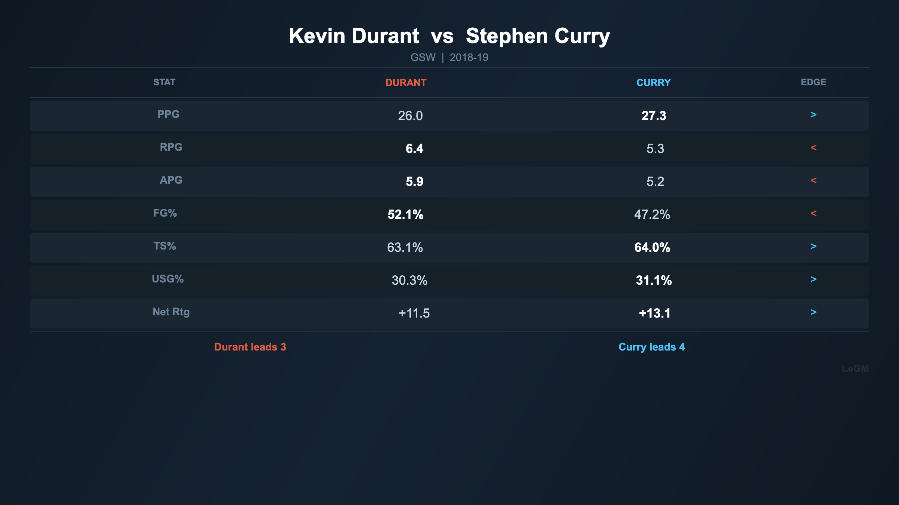
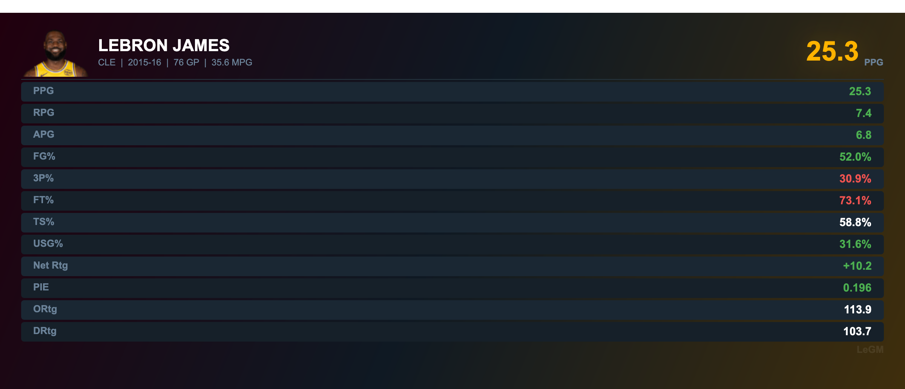
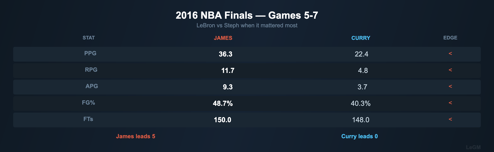

# LeGM Lab

An AI-powered NBA take analyzer that fact-checks basketball opinions with real stats, generates visual stat cards, and roasts bad takes on X (Twitter).

> "@LeGMLab LeBron is washed"
>
> "Bro averaged 25.7/7.3/8.3 last season on 54% TS at age 40. Your take is washed, not LeBron. Respectfully."



## How It Works

```
@mention or search tweet
  -> LLM analyzes the take (Claude / OpenAI)
  -> Fetches real NBA stats via tools (season avgs, game logs, advanced stats)
  -> Generates verdict (trash / mid / valid) + roast (<280 chars)
  -> Renders stat comparison chart (optional)
  -> Posts reply with chart attached
```

The agent runs a multi-turn tool-use loop: the LLM decides which stats to look up, gets the results, then writes its verdict backed by real numbers.

## Features

- **Take analysis** -- Verdicts (trash/mid/valid) with confidence scores and stat-backed reasoning
- **6 stat tools** -- Season averages, recent games, advanced stats, player comparisons, team standings, team records
- **Chart generation** -- Dark-themed stat cards and comparison tables with winner indicators
- **X bot** -- Reactive (replies to @mentions) with rate limiting and monthly budgets
- **REST API** -- FastAPI endpoints for programmatic take analysis
- **Multi-LLM** -- Claude, OpenAI, or any OpenAI-compatible provider

## Example Output

| Stat Card | Flexible Comparison |
|-----------|-------------------|
|  |  |

## Quick Start

### Prerequisites

- Python 3.12+
- [uv](https://docs.astral.sh/uv/) package manager

### Install

```bash
git clone https://github.com/KenWuqianghao/LeGM-Lab.git
cd LeGM-Lab
uv sync
```

### Analyze a single take

```bash
echo 'ANTHROPIC_API_KEY=sk-...' > .env
uv run python scripts/run_single_take.py "Steph Curry is the greatest shooter ever"
```

### Run the API server

```bash
uv run uvicorn legm.main:app --reload
```

```
POST /api/v1/takes/analyze  {"take": "Jokic is the best center ever"}
GET  /api/v1/takes           # list recent analyses
GET  /health                 # liveness probe
```

### Run the X bot

```bash
# Add Twitter creds to .env (see Configuration below)
BOT_DRY_RUN=true uv run python scripts/run_bot.py
```

## Configuration

All config is via environment variables (or `.env` file):

| Variable | Description |
|----------|-------------|
| `ANTHROPIC_API_KEY` | Claude API key |
| `LLM_PROVIDER` | `claude`, `openai`, or `openai_compat` |
| `LLM_MODEL` | Model name (default: `claude-sonnet-4-6`) |
| `OPENAI_COMPAT_BASE_URL` | Base URL for OpenAI-compatible endpoint |
| `OPENAI_COMPAT_API_KEY` | API key for OpenAI-compatible endpoint |
| `OPENAI_COMPAT_MODEL` | Model name for OpenAI-compatible endpoint |
| `DATABASE_URL` | SQLAlchemy URL (default: SQLite) |
| `TWITTER_API_KEY` | X API key |
| `TWITTER_API_SECRET` | X API secret |
| `TWITTER_BEARER_TOKEN` | X bearer token |
| `TWITTER_ACCESS_TOKEN` | X access token |
| `TWITTER_ACCESS_TOKEN_SECRET` | X access token secret |
| `TWITTER_BOT_USER_ID` | Bot's numeric X user ID |
| `BOT_DRY_RUN` | `true` to log without posting |
| `BOT_PROACTIVE_ENABLED` | `true` to enable proactive search loop |
| `BOT_MENTION_POLL_INTERVAL` | Seconds between mention polls (default: 60) |
| `BOT_MONTHLY_BUDGET` | Max tweets per month (default: 450) |

## Deployment

### Bot (Railway)

The bot runs on [Railway](https://railway.app) as a background worker. A `Dockerfile` and `railway.toml` are included.

```bash
# Local testing
docker compose up --build

# Railway
# 1. Connect GitHub repo in Railway dashboard
# 2. Add a volume mounted at /data
# 3. Set env vars in Railway UI
# 4. Deploy
```

### LeLM Inference (Modal)

The custom [LeLM](https://github.com/KenWuqianghao/LeLM) model (Qwen3-8B fine-tuned on NBA takes) is served via [Modal](https://modal.com) on a T4 GPU with scale-to-zero. It exposes an OpenAI-compatible `/v1/chat/completions` endpoint that the bot connects to via the `openai_compat` provider.

```bash
# Deploy
modal deploy deploy/modal_lelm.py

# Test
curl -X POST https://<modal-url>/v1/chat/completions \
  -H "Authorization: Bearer <AUTH_TOKEN>" \
  -H "Content-Type: application/json" \
  -d '{"model":"lelm","messages":[{"role":"user","content":"Is LeBron washed?"}]}'
```

Bot env vars to connect:
```
LLM_PROVIDER=openai_compat
OPENAI_COMPAT_BASE_URL=https://<modal-url>/v1
OPENAI_COMPAT_API_KEY=<AUTH_TOKEN>
OPENAI_COMPAT_MODEL=lelm
```

## Project Structure

```
src/legm/
  agent/        # LLM agent loop, system prompt, tool definitions
  api/          # FastAPI routes (takes, bot control, health)
  db/           # SQLAlchemy models, migrations, repository
  llm/          # Multi-provider LLM abstraction (Claude, OpenAI, LeLM)
  stats/        # NBA API client, caching, chart generation
  twitter/      # X bot, tweet service, rate limiter, filters
  config.py     # Pydantic settings
  main.py       # FastAPI app
deploy/
  modal_lelm.py       # Modal deployment for LeLM inference
scripts/
  run_bot.py          # Bot CLI entrypoint
  run_single_take.py  # Analyze one take from CLI
  run_live_takes.py   # Batch analysis demo
```

## Development

```bash
uv run pytest -x -v                        # run tests
ruff check --fix . && ruff format .        # lint + format
uv run python -m mypy .                    # type check
```

## Tech Stack

- **Backend**: Python 3.12 / FastAPI / SQLAlchemy / Pydantic v2
- **AI**: Claude (Anthropic) / OpenAI / [LeLM](https://huggingface.co/KenWu/LeLM-GGUF) with tool-use agent loop
- **Data**: NBA API (nba_api) / Matplotlib for chart rendering
- **Bot**: Tweepy (X API v2) / asyncio event loops
- **Infra**: Docker / Railway / Modal (GPU inference) / SQLite (dev) / PostgreSQL (prod)

## License

MIT
